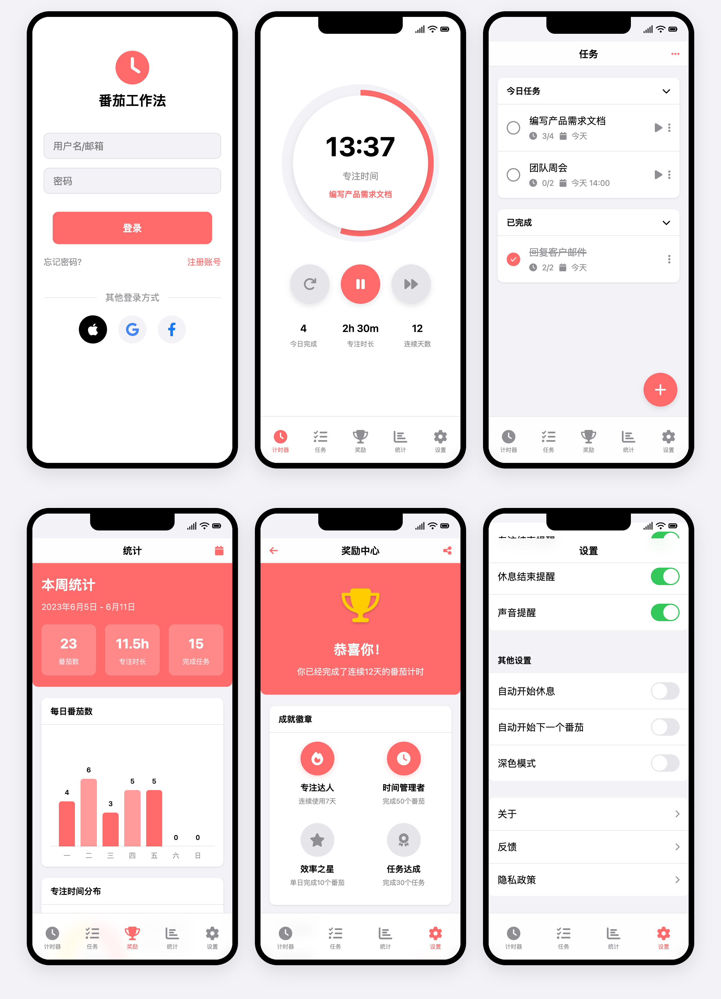

# 番茄时钟应用原型

这是一个基于iOS设计风格的番茄工作法应用原型，通过纯HTML和CSS实现，展示了完整的应用界面和交互设计。

## 视频教程

[Trae AI -- 从初级到入门 第十一课 「苹果应用」番茄时钟](https://www.bilibili.com/video/BV1WMQhY8Eyq/?spm_id_from=333.1387.homepage.video_card.click&vd_source=921270471e745ada21af6b8406e3ff55)

这个视频教程展示了如何在30分钟内完成一个iOS风格的番茄时钟应用原型开发。

## 功能特点

- 🎯 专业的番茄工作法计时器
- 🎨 iOS风格的界面设计
- 📱 响应式布局，完美适配移动设备
- 👤 用户登录和注册功能展示
- 📊 任务完成统计和成就系统
- 🔄 多种工作模式切换
- 🌈 优雅的动画和交互效果

## 技术实现

- 使用纯HTML和CSS构建
- Font Awesome图标库集成
- iOS原生设计规范
- 模块化的CSS样式组织
- 响应式设计原则

## 项目结构

```
├── pomodoro-timer-index.html  # 主页面HTML文件
└── pomodoro-timer-index-html.png  # 项目预览图
```

## 使用说明

1. 克隆或下载项目到本地
2. 使用现代浏览器打开`pomodoro-timer-index.html`文件
3. 体验完整的番茄时钟应用原型

## 界面预览

项目包含以下主要界面：



- 启动页：展示应用logo和标语
- 登录页：提供账号登录和第三方登录选项
- 主计时器：番茄工作法核心功能
- 统计页面：展示工作效率和成就数据
- 设置界面：个性化配置选项

## 贡献

欢迎提交Issue和Pull Request来帮助改进这个项目！

## 许可证

MIT License